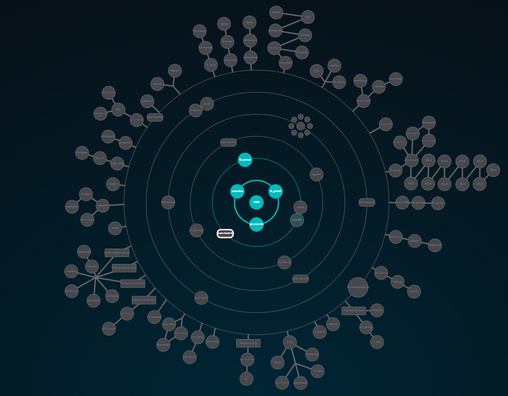

# 42Projects

### 42 NETWORK

### 42 curriculum.

|Project|Branch|Curriculum|Difficulty|Language|Status|
|:-:|:-:|:-:|:-:|:-:|:-:|
|[Libft](subjects/libft/libft.pdf)|Unix|42 Common-Core|T1|C|:rooster:|
|[Get Next Line](subjects/get_next_line/GetNextLine.pdf)|Unix|42 Common-Core|T1|C|:rooster:|
|[Ft_printf](subjects/ft_printf/ft_printf.pdf)|Unix|42 Common-Core|T1|C|:rooster:|
|[Born2beRoot](subjects/born2beroot/Born2beRoot.pdf)|Unix|42 Common-Core|T1|Config|:rooster:|
|[pipex](subjects/pipex/pipex.pdf)|Unix|42 Common-Core|T1|C|:rooster:|
|[Push_swap](subjects/push_swap/PushSwap.pdf)|Unix|42 Common-Core|T1|C|:rooster:|
|[Fdf](subjects/Fdf/fdf.pdf)|Unix|42 Common-Core|T1|C|:rooster:|
|[Philosophers](subjects/Philosophers/en.subject.pdf)|Unix|42 Common-Core|T1|C|:rooster:|
|[Minishell](subjects/minishell/en.subject.pdf)|Unix|42 Common-Core|T1|C|:rooster:|
|[Net_practice](subjects/net_practice/en.subject.pdf)|Unix|42 Common-Core|T1|Networking|:rooster:|
|[MiniRT](subjects/miniRT/minirt.pdf)|Unix|42 Common-Core|T1|C|:rooster:|
|[Cub3d](subjects/cub3d/cube3d.pdf)|Unix|42 Common-Core|T1|C|:rooster:|
|[ft_containers](subjects/ft_containers/ft_containers.pdf)|Unix|42 Common-Core|T1|C++|:rooster:|
|[WebServ](subjects/webserv/en.subject.pdf)|Unix|42 Common-Core|T1|C++|:rooster:|
|[Ft_Irc](subjects/ft_irc/ft_irc.pdf)|Unix|42 Common-Core|T1|C++|:rooster:|
|[Inception](subjects/Inception/Inception.pdf)|Unix|42 Common-Core|T1|Docker/Wordpress|:rooster:|
|[Ft_transcendence](subjects/ft_transcendence/ft_transcendence.pdf)|Unix|42 Common-Core|T1|js|:rooster:|
  
 
